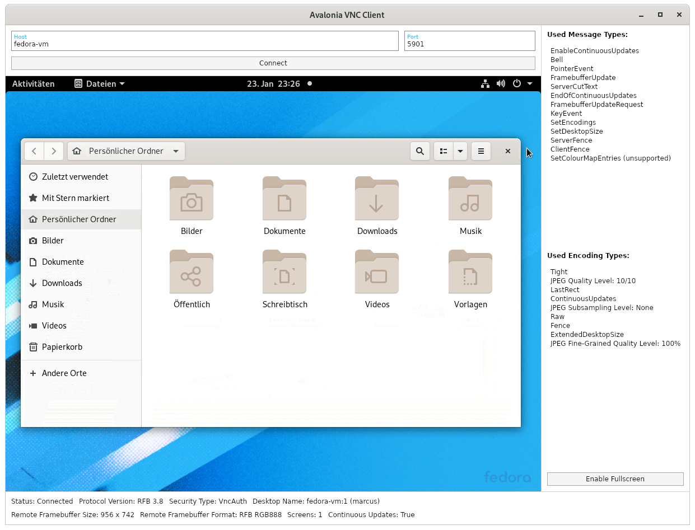

# VNC-Client Library for C#

This project provides a fully managed C#-Library that implements the RFB protocol for easy integration of VNC-Client features into own applications.


### [Website](https://vnc-client.marcusw.de/)
### [API Documentation](https://vnc-client.marcusw.de/apidoc/api/index.html)

_This library is currently in alpha state, but has proven to be quite stable and is ready for daily use. A stable release will follow, as soon as it's
feature-complete._

### Sample Application



Source Code: [AvaloniaVncClient](samples/AvaloniaVncClient)

### Main Design Goals

- 🌟 **High performance:** The usage of very efficient image encoding techniques like `Tight` or `ZRLE` allows a smooth image transmission even over slower connections. The code is also
  written in a way that makes it very CPU-time-saving.
- 🌟 **Platform-independence:** All platform-specific components are abstracted away so the core library is theoretically usable everywhere, where C# runs, too.
- 🌟 **Server compatibility:** Tested with *TigerVNC Server*, *LibVNCServer*, *RealVNC VNC Connect*, *Vino-Server* and *UltraVNC*. This implementation follows the RFB protocol specification very carefully, so it's probably compatible with many more servers.
- 🌟 **Stability:** Battle-tested and proven to be very reliable.
- 🌟 **Modular & Extensible:** The very modular API design allows the easy addition of more Security, Message and Encoding Types as well as the replacement of main implementation components.
- 🌟 **No external dependencies:** The core library does not use any libraries outside of the .NET SDK.

### Features

- Highly configurable and extensible structure
- Flexible transport layer selection (TCP by default)
- Automatic reconnects with configurable behaviour
- Supported security types: `None`, `VNC Authentication`
- Supported message types: `SetEncodings`, `FramebufferUpdateRequest`, `FramebufferUpdate`, `ServerCutText`, `SetDesktopSize`, `ServerFence`, `ClientFence`, `EnableContinuousUpdates`, `EndOfContinuousUpdates`, `PointerEvent`, `KeyEvent`, `Bell`
- Supported frame encoding types: `Raw`, `CopyRect`, `zLib`, `ZRLE`, `Tight`
- Supported pseudo encoding types: `Fence`, `ContinuousUpdates`, `LastRect`, `JPEG Quality Level`, `JPEG Fine-Grained Quality Level`, `JPEG Subsampling Level`, `DesktopSize`, `ExtendedDesktopSize`
- Allows smooth image transmission or even video streaming (over sufficiently fast connections) thanks to a very efficient implementation
- Allows changing the JPEG quality levels
- Supports all kinds of color depths up to - theoretically - even 32bit HDR (untested, please tell me if you know a server to test this with 😀)
- Supports continuous framebuffer updates and advanced [flow control](https://github.com/TigerVNC/tigervnc/wiki/Development:-Latency)
- Supports keyboard and pointer input with horizontal and vertical scrolling
- Supports clipboard sharing (currently only server to client, I'm open for PRs)
- Full support for dynamic session resizing (server-side and client-side) with all the APIs exposed for multi-monitor scenarios
- Option for visualizing received rectangles (useful for debugging or analytic purposes)
- The render target can be detached or replaced and any time and the client can even run in a fully headless mode without any rendering
- Exposes many useful connection details in an observable manner (`INotifyPropertyChanged`)
- Very detailed log output for debugging/analytic purposes

Most of these features are demonstrated by the included sample applications.

### NuGet-Packages

**Core library:** [MarcusW.VncClient](https://www.nuget.org/packages/MarcusW.VncClient)

This is library contains the main protocol implementation and is completely platform-agnostic thanks to some abstractions using C# interfaces. It has no external dependencies.

**Adapter libraries:** [MarcusW.VncClient.Avalonia](https://www.nuget.org/packages/MarcusW.VncClient.Avalonia), more may follow...

These libraries provide platform specific implementations for the mentioned interfaces and provide e.g. user controls that can just be dropped into an UI application to make use of the VNC library very easily. These libraries depend on the core VNC library as well as the corresponding UI library.

## Support me!

Developing a VNC client implementation is hell a lot of work. Months of my spare time went into this. So if you use this library in a commercial context, please consider giving something back - and of course let me know about where you used it 😀.

### [Donate with PayPal](https://www.paypal.com/donate?hosted_button_id=M45EZG5TDHMBJ)

## Usage

### Avalonia User Control

In case you're building an Avalonia UI application, extending it with VNC support is very easy, because a ready-to-use adapter implementation for this UI framework is already there. Just add the NuGet-Package `MarcusW.VncClient.Avalonia` to your project and add a `<VncView />`-control to your application window. This is the place where the VNC connection will be shown.

```xaml
<vnc:VncView Connection="{Binding RfbConnection}" />
```

The connection that is shown in this view can be specified by setting the value of the `Connection`-property, either through code-behind or using a view model binding.

To create a new connection object, do the following:

```c#
// Create and populate a default logger factory for logging to Avalonia logging sinks.
var loggerFactory = new LoggerFactory();
loggerFactory.AddProvider(new AvaloniaLoggerProvider());

// Create a vnc client object. This can be used to easily start new connections.
var vncClient = new VncClient(loggerFactory);

// Create a new authentication handler to handle authentication requests from the server
var authenticationHandler = new DemoAuthenticationHandler(); // see below

// Configure the connect parameters
var parameters = new ConnectParameters {
    TransportParameters = new TcpTransportParameters {
        Host = "hostname or ip address",
        Port = 5900
    },
    AuthenticationHandler = authenticationHandler
    // There are many more parameters to explore...
};

// Start a new connection and save the new connection object
RfbConnection = await vncClient.ConnectAsync(parameters, cancellationToken).ConfigureAwait(true);
```

As soon as you set a `VncView` to show this connection object, you will see the remote session on your screen and should be able to interact with it. The view will register itself as the render target of the connection object. If you don't want to use the prebuilt `VncView` control, you can also set the `parameters.InitialRenderTarget` and `parameters.InitialOutputHandler` to your custom implementation. Please consult the [API documentation](https://vnc-client.marcusw.de/apidoc/api/MarcusW.VncClient.Rendering.IRenderTarget.html) for details.

The provided `AuthenticationHandler` gets called by the protocol implementation when the server requires the connection to be secured with e.g. the `VNC Authentication` security type. In this case the server requests a password input from the authentication handler which in turn could then show an input-dialog to the user.

```c#
public class DemoAuthenticationHandler : IAuthenticationHandler
{
    /// <inhertitdoc />
    public async Task<TInput> ProvideAuthenticationInputAsync<TInput>(RfbConnection connection, ISecurityType securityType, IAuthenticationInputRequest<TInput> request)
        where TInput : class, IAuthenticationInput
    {
        if (typeof(TInput) == typeof(PasswordAuthenticationInput))
        {
            string password = "verysecure!!"; // Retrieve the password somehow

            return (TInput)Convert.ChangeType(new PasswordAuthenticationInput(password), typeof(TInput));
        }

        throw new InvalidOperationException("The authentication input request is not supported by this authentication handler.");
    }
}
```

### TurboJPEG Requirement

For maximum performance, this VNC client supports the `Tight` frame encoding type. But what makes this encoding type so efficient is mainly the use of a extremely optimized JPEG decoder called "TurboJPEG" [(or libjpeg-turbo)](https://libjpeg-turbo.org/About/TurboJPEG). Because of this, `Tight` is only available, if your application or the used operating system ships with some version of this native library. If it doesn't, this encoding type will be automatically disabled and the sample application will show a warning. Your application should probably do this, too.

### Manually sending Messages

_Documentation follows..._

### Manually implementing `IRenderTarget`

_Documentation follows..._

## Contributing

Contributions are always welcome! Wanna fix a bug or add support for a new protocol extension? Go ahead!

But before you spend a lot of time working on a Pull Request, please create an Issue first to communicate, what you are working on, to avoid duplicated work and maybe discuss some details about the way you're implementing the fix/feature.

Here is a very great community-maintained protocol specification that I used and which is probably also useful to you: [rfbproto](https://github.com/rfbproto/rfbproto/blob/master/rfbproto.rst)

### 🎉 Happy coding! 🎉
