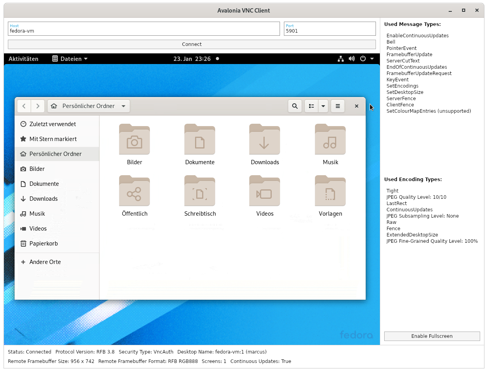

# VNC-Client Library for C#


This project provides a very performant, fully managed C#-Library that implements the RFB protocol for easy integration of VNC-Client features into own applications. It's also cross-platform and runs every where .NET Core (or .NET 5 and so on...) runs.

### [API Documentation](https://vnc-client.marcusw.de/apidoc/api/index.html)

-- _This library is currently in alpha state, but has proven to be quite stable and is ready for daily use. A stable release will follow, as soon as it's
feature-complete._ --

### Sample Application



Source Code: [AvaloniaVncClient](samples/AvaloniaVncClient)

### Main Design Goals

- 🌟 **High performance:** The usage of very efficient image encoding techniques like `Tight` or `ZRLE` allows a smooth image transmission even over slower connections. The code is also
  written in a way that makes it very CPU-time-saving.
- 🌟 **Platform-independence:** All platform-specific components are abstracted away so the core library is theoretically usable everywhere, where C# runs, too.
- 🌟 **Server compatibility:** Tested with *TigerVNC Server*, *LibVNCServer*, *RealVNC VNC Connect*, *Vino-Server* and *UltraVNC*. This implementation follows the RFB protocol specification very carefully, so it's probably compatible with many more servers.
- 🌟 **Stability:** Battle-tested and proven to be very reliable.
- 🌟 **Modular & Extensible:** The very modular API design allows the easy addition of more Security, Message and Encoding Types as well as the replacement of main implementation components.
- 🌟 **No external dependencies:** The core library does not use any libraries outside of the .NET SDK.

### Features

- Highly configurable and extensible structure
- Flexible transport layer selection (TCP by default)
- Automatic reconnects with configurable behaviour
- Supported security types: `None`, `VNC Authentication`
- Supported message types: `SetEncodings`, `FramebufferUpdateRequest`, `FramebufferUpdate`, `ServerCutText`, `SetDesktopSize`, `ServerFence`, `ClientFence`, `EnableContinuousUpdates`, `EndOfContinuousUpdates`, `PointerEvent`, `KeyEvent`, `Bell`
- Supported frame encoding types: `Raw`, `CopyRect`, `zLib`, `ZRLE`, `Tight`
- Supported pseudo encoding types: `Fence`, `ContinuousUpdates`, `LastRect`, `JPEG Quality Level`, `JPEG Fine-Grained Quality Level`, `JPEG Subsampling Level`, `DesktopSize`, `ExtendedDesktopSize`
- Allows smooth image transmission or even video streaming (over sufficiently fast connections) thanks to a very efficient implementation
- Allows changing the JPEG quality levels
- Supports all kinds of color depths up to - theoretically - even 32bit HDR (untested, please tell me if you know a server to test this with 😀)
- Supports continuous framebuffer updates and advanced [flow control](https://github.com/TigerVNC/tigervnc/wiki/Development:-Latency)
- Supports keyboard and pointer input with horizontal and vertical scrolling
- Supports clipboard sharing (currently only server to client, I'm open for PRs)
- Full support for dynamic session resizing (server-side and client-side) with all the APIs exposed for multi-monitor scenarios
- Option for visualizing received rectangles (useful for debugging or analytic purposes)
- The render target can be detached or replaced and any time and the client can even run in a fully headless mode without any rendering
- Exposes many useful connection details in an observable manner (`INotifyPropertyChanged`)
- Very detailed log output for debugging/analytic purposes

Most of these features are demonstrated by the included sample applications.

### NuGet-Packages

**Core library:** [MarcusW.VncClient](https://www.nuget.org/packages/MarcusW.VncClient)

This is library contains the main protocol implementation and is completely platform-agnostic thanks to some abstractions using C# interfaces. It has no external dependencies.

**Adapter libraries:** [MarcusW.VncClient.Avalonia](https://www.nuget.org/packages/MarcusW.VncClient.Avalonia), more may follow...

These libraries provide platform specific implementations for the mentioned interfaces and provide e.g. user controls that can just be dropped into an UI application to make use of the VNC library very easily. These libraries depend on the core VNC library as well as the corresponding UI library.

**You can find the latest packages for every commit that's pushed to master on [GitHub Packages](https://github.com/MarcusWichelmann?tab=packages&repo_name=MarcusW.VncClient).**

## Support me!

Developing a VNC client implementation is hell a lot of work. Months of my spare time went into this. So if you use this library in a commercial context, please consider giving something back - and of course let me know about where you used it 😀.

### [Donate with PayPal](https://www.paypal.com/donate?hosted_button_id=M45EZG5TDHMBJ)

## Usage

### Creating Connections

Let's prepare some objects which you can later use to start as many new connections as you want:

```c#
// Create and populate a default logger factory for logging to Avalonia logging sinks.
var loggerFactory = new LoggerFactory();
loggerFactory.AddProvider(new AvaloniaLoggerProvider());

// Create a vnc client object. This can be used to easily start new connections.
var vncClient = new VncClient(loggerFactory);

// Create a new authentication handler to handle authentication requests from the server
var authenticationHandler = new DemoAuthenticationHandler(); // see below
```

The provided `DemoAuthenticationHandler` gets called by the protocol implementation when the server requires newly established connections to be secured with e.g. the `VNC Authentication` security type. In this case the server requests a password input from the authentication handler which in turn could then show an input-dialog to the user.

```c#
public class DemoAuthenticationHandler : IAuthenticationHandler
{
    /// <inhertitdoc />
    public async Task<TInput> ProvideAuthenticationInputAsync<TInput>(RfbConnection connection, ISecurityType securityType, IAuthenticationInputRequest<TInput> request)
        where TInput : class, IAuthenticationInput
    {
        if (typeof(TInput) == typeof(PasswordAuthenticationInput))
        {
            string password = "verysecure!!"; // Retrieve the password somehow

            return (TInput)Convert.ChangeType(new PasswordAuthenticationInput(password), typeof(TInput));
        }

        throw new InvalidOperationException("The authentication input request is not supported by this authentication handler.");
    }
}
```

Now you can use the `vncClient`  and `authenticationHandler` objects to connect to a VNC server by doing the following in the code:

```c#
// Configure the connect parameters
var parameters = new ConnectParameters {
    TransportParameters = new TcpTransportParameters {
        Host = "hostname or ip address",
        Port = 5900
    },
    AuthenticationHandler = authenticationHandler
    // There are many more parameters to explore...
};

// Start a new connection and save the returned connection object
RfbConnection = await vncClient.ConnectAsync(parameters, cancellationToken).ConfigureAwait(true);
```

You will receive an instance of the `RfbConnection` class which represents the active connection, exposes properties for the connection status and has methods to interact with it.

But probably, you also want to make the connection somehow visible on your screen. There are multiple ways to achieve this, depending on the application framework you use:

### Avalonia User Control

In case of the Avalonia UI framework, there is a ready-to-use user control which can be added to applications to view connections and interact with them.

Extending an Avalonia application with VNC support is very easy, just add the NuGet-Package `MarcusW.VncClient.Avalonia` to your project and add a `<VncView />`-control to your application window. This is the place where the VNC connection will be shown.

```xaml
<vnc:VncView Connection="{Binding RfbConnection}" />
```

The connection that is shown inside this view can be specified by setting the value of the `Connection`-property, either in code-behind or through a view model binding. As soon as you set a `VncView` to show a connection object, you will see the remote session on your screen and should be able to interact with it.

This works, because the view will register itself as the `RenderTarget` and `OutputHandler` of the connection object.

### Manual Integration

If you don't want to use the prebuilt `VncView` control or there is none available for your used application framework, you can also manually implement the required interfaces:

- **IRenderTarget:** Implement this interface to give the protocol implementation a place to render its frames to. Each time the client receives a new framebuffer update, it will call the `GrabFramebufferReference` method and pass the framebuffer size as an argument. Your implementation should then use some APIs of your application framework to create a bitmap of the given size or **re-use** the previous one, if the size didn't change (very important for performance reasons!). Now return a new object that implements `IFramebufferReference` to tell the protocol implementation about the memory location and the format of your bitmap. The protocol implementation will access the memory of the bitmap directly and will change its contents to render the received framebuffer update. After everything is rendered, `Dispose()` will be called on that framebuffer reference and your `IRenderTarget` implementation should ensure that the contents of the bitmap are rendered to the application window. Please take a look into the corresponding implementations for Avalonia UI as an example of how things should work: [RfbRenderTarget](https://github.com/MarcusWichelmann/MarcusW.VncClient/blob/master/src/MarcusW.VncClient.Avalonia/RfbRenderTarget.cs), [AvaloniaFramebufferReference](https://github.com/MarcusWichelmann/MarcusW.VncClient/blob/master/src/MarcusW.VncClient.Avalonia/Adapters/Rendering/AvaloniaFramebufferReference.cs)
- **IOutputHandler:** Implement this interface to handle some other types of output from the server. For example, `HandleServerClipboardUpdate` will be called by the protocol implementation, when the server notified the client about a change of the server-side clipboard content. You can then call some method of your application framework to set the client-side clipboard to the same content.

After you have implemented these interfaces, you can make the connection use them by setting the `RfbConnection.RenderTarget` and `RfbConnection.OutputHandler` properties. You can also detatch the connection form your render target by setting `RfbConnection.RenderTarget` to `null`. When doing this, the client implementation will render it's frames to nowhere, which is a useful feature to keep a connection alive in the background without wasting CPU resources on rendering the received frames.

There are also two connection parameters called `InitialRenderTarget` and `InitialOutputHandler` which allow you to attach render target and output handler right from the beginning.

To send messages for keyboard or mouse input, you can call the `EnqueueMessage` or `SendMessageAsync` method on the connection object. Again, please take a look at the [Avalonia-specific implementation](https://github.com/MarcusWichelmann/MarcusW.VncClient/blob/master/src/MarcusW.VncClient.Avalonia/VncView.MouseInput.cs) for details on this.

### TurboJPEG Requirement

For maximum performance, this VNC client supports the `Tight` frame encoding type. But what makes this encoding type so efficient is mainly the use of a extremely optimized JPEG decoder called "TurboJPEG" [(or libjpeg-turbo)](https://libjpeg-turbo.org/About/TurboJPEG). Because of this, `Tight` is only available, if your application or the used operating system ships with some version of this native library. If it doesn't, this encoding type will be automatically disabled and the sample application will show a warning. Your application should probably do this, too.

In future, maybe, I'll extend my CI builds to ship precompiled TurboJPEG-binaries for the most common operating systems directly in the NuGet package. Please vote on [this issue](https://github.com/MarcusWichelmann/MarcusW.VncClient/issues/5) if you want this. 😀

## Contributing

Contributions are always welcome! Wanna fix a bug or add support for a new protocol extension? Go ahead!

But before you spend a lot of time working on a Pull Request, please create an Issue first to communicate, what you are working on, to avoid duplicated work and maybe discuss some details about the way you're implementing the fix/feature.

Here is a very great community-maintained protocol specification that I used and which is probably also useful to you: [rfbproto](https://github.com/rfbproto/rfbproto/blob/master/rfbproto.rst)

### 🎉 Happy coding! 🎉
